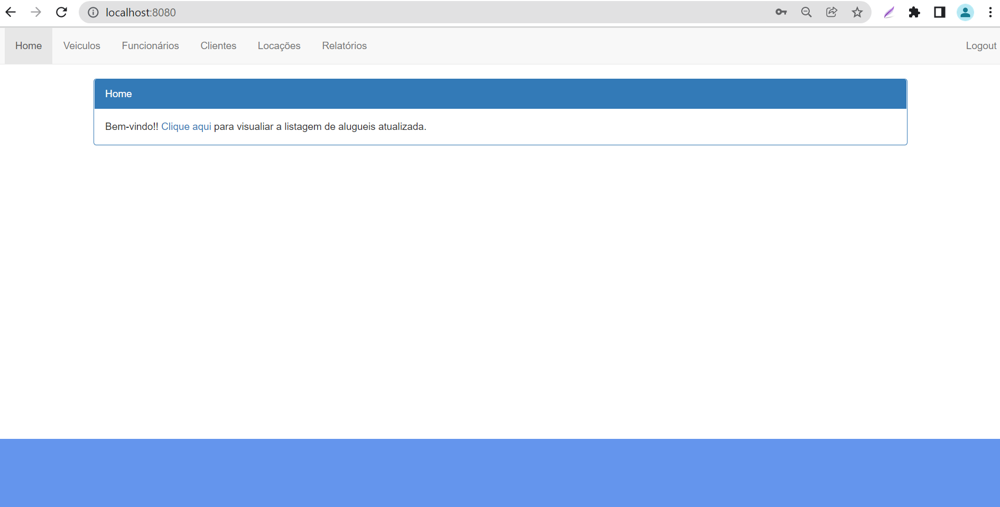
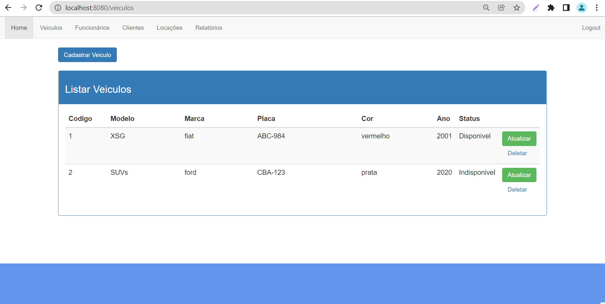
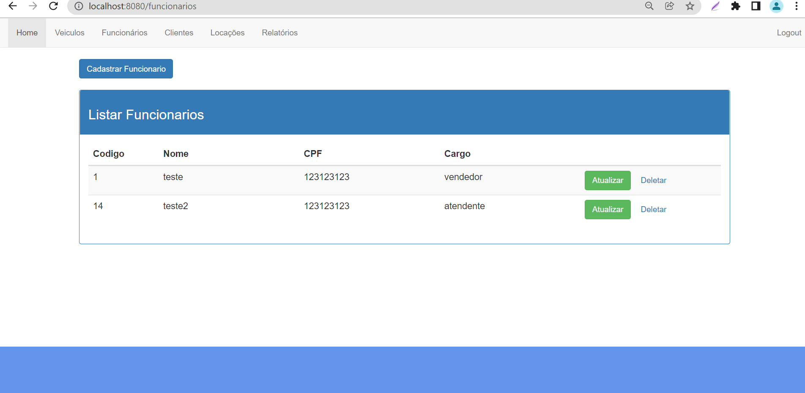
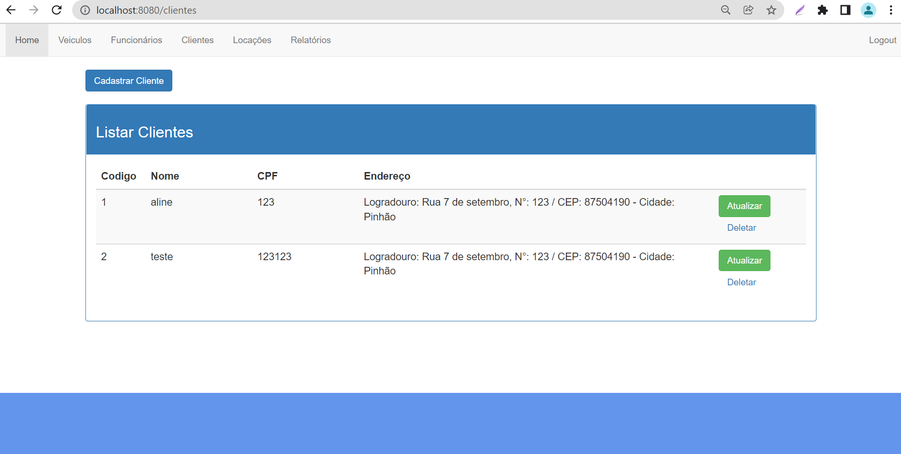
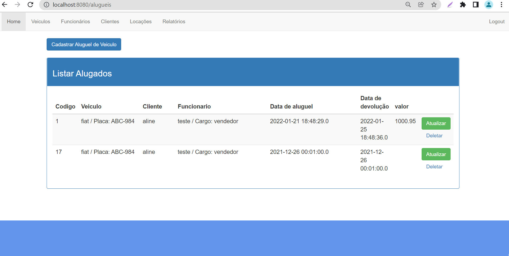
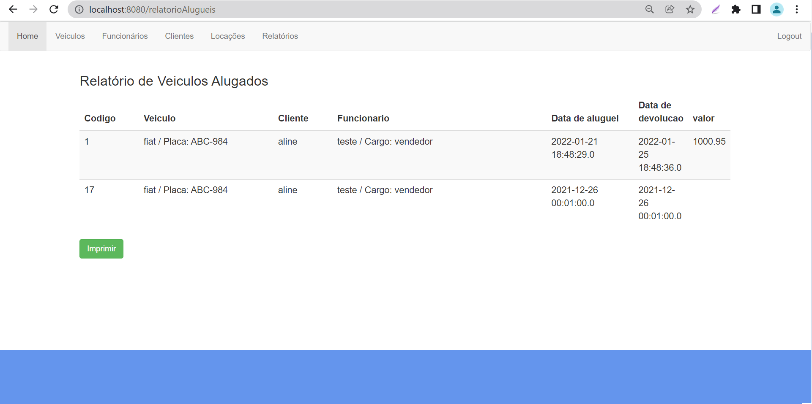
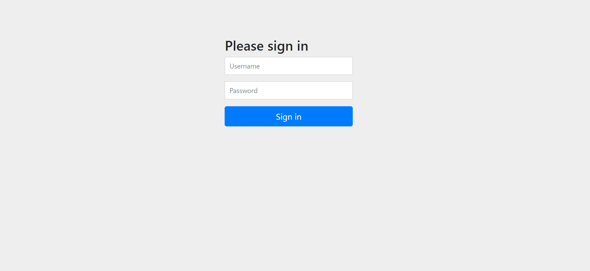
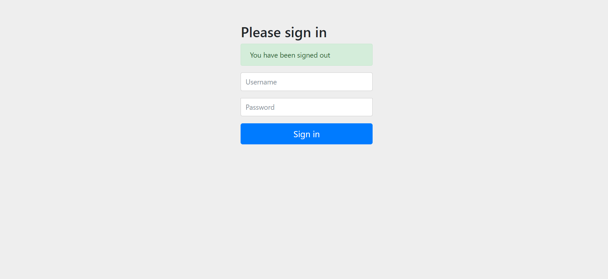

# Projeto - Spring Boot Java - UniAlfa Umuarama - 2022

CRUD simples usando Spring Boot e JSP (Java Server Pages)

* Após clonar o projeto execute o comando abaixo

```bash
$ mvnw spring-boot:run
```

**Pronto agora é só abrir o http://localhost:8080.**

Obs.: Para realizar o login

* Username: admin
* Password: admin

## Banco H2

Dados do banco no arquivo aplication.propeties


## Framework Utilizado

- [Spring-Boot](https://spring.io/projects/spring-boot)


Demonstração do projeto

Tela Home


Tela Listagem de Veiculos


Tela Listagem de Funcionarios


Tela Listagem de Clientes


Tela Listagem de Alugueis de Veiculos


Tela Relatório


Tela de Login


Tela de Logout

